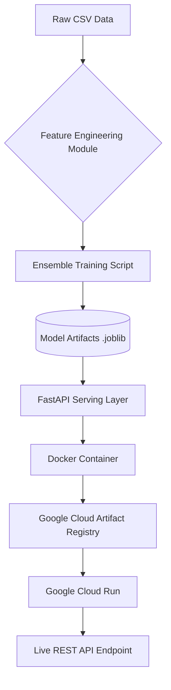

# End-to-End Telco Customer Churn Prediction System

### Project Vision

In the telecommunications sector, customer retention is a primary driver of long-term profitability. This project provides a production-grade predictive engine that identifies high-risk customers with 81.8% accuracy.

This repository implements a complete MLOps lifecycle: from modular feature engineering and ensemble training to an automated CI/CD deployment pipeline targeting Google Cloud Run.

---

### System Architecture



---

### Key Technical Features

* **Ensemble Modeling:** Utilizes a Soft-Voting Classifier (Random Forest + XGBoost). This hybrid approach maximizes the precision of tree-based algorithms while reducing variance through ensembling.
* **Modular Preprocessing:** Feature engineering logic is decoupled into a standalone module (src/preprocessing.py) to ensure 100% parity between training and real-time inference.
* **Custom Engineered Features:**
* Total_Services: Aggregated engagement metric across internet and security add-ons.
* Avg_Monthly_Cost: Derived cost metric to detect price-sensitive behavior.
* Has_Protection: Binary signal for customer loyalty through security bundling.


* **Industrial Serving:** Wrapped in FastAPI for asynchronous high-performance serving and Dockerized for environment portability.

---

### Repository Structure

```text
.
├── .github/workflows/      # CI/CD Automation (GitHub Actions)
├── data/                   # Dataset storage (Raw/Processed)
├── models/                 # Serialized model and feature schema (.joblib)
├── notebooks/              # Research, EDA, and Model Development
├── src/                    # Production Source Code
│   ├── preprocessing.py    # Shared Engineering Logic
│   ├── train.py            # Automated Training Pipeline
│   └── main.py             # FastAPI REST Service
├── Dockerfile              # Containerization manifest
├── requirements.txt        # Managed dependencies
└── deploy.bat              # Cloud deployment automation script (Windows)

```

---

### Model Performance

| Metric | Score |
| --- | --- |
| Test Accuracy | 81.8% |
| Precision (Churn) | 0.70 |
| F1-Score | 0.61 |

The ensemble approach successfully improved the minority class recall, making the model significantly more useful for proactive business interventions.

---

### Google Cloud Run Deployment Details

The system is architected to run on Google Cloud Platform (GCP) using a serverless approach:

* **Containerization:** The application is packaged using Docker (Python 3.10-slim) to ensure consistency across the local development and the GCP production environment.
* **Google Cloud Artifact Registry:** Containers are pushed to a central repository to manage versioning.
* **Google Cloud Run:** The FastAPI service is deployed to Cloud Run, a managed compute platform that automatically scales the containerized application.
* **Scalability:** Configured to scale to zero when no traffic is detected, minimizing infrastructure costs while being able to handle high-concurrency requests through asynchronous FastAPI processing.

**Deployment Commands:**

```cmd
:: Build and push to Google Cloud Build
gcloud builds submit --tag gcr.io/[PROJECT_ID]/churn-api .

:: Deploy to Cloud Run
gcloud run deploy churn-api --image gcr.io/[PROJECT_ID]/churn-api --platform managed --region us-central1 --allow-unauthenticated

```

---

### MLOps and CI/CD

1. **GitHub Actions:** The repository includes a workflow (.github/workflows/main.yml) that triggers on every push to the main branch. It automates the process of authenticating with GCP, building the new image, and deploying it to Cloud Run.
2. **Schema Enforcement:** To prevent production failures, the system uses model_columns.joblib to validate that incoming API request features match the exact training schema.

---

### Local Setup and Execution

**1. Setup Environment**

```cmd
pip install -r requirements.txt

```

**2. Train and Export Artifacts**

```cmd
python src/train.py

```

**3. Launch API locally**

```cmd
uvicorn src.main:app --reload

```

---

### Author

**CH S N Vijay Kiran**
GCP Data Engineer

> "Bridging the gap between Data Engineering and Data Science through MLOps."

